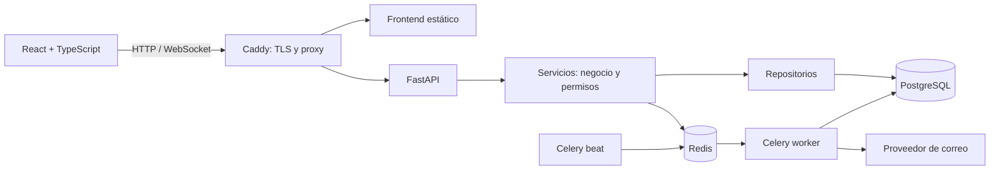

# OpsDesk

**Proyecto full stack desplegado y documentado para revisión técnica.** OpsDesk es un SaaS B2B de gestión operativa con organizaciones, proyectos, tareas, tickets y colaboración. El repositorio muestra cómo se han construido la API, los permisos, los procesos asíncronos, las pruebas y el despliegue.

**[Abrir OpsDesk en producción ↗](https://rgalvaro.es/login)** · [Ver página pública](https://rgalvaro.es/) · [Arquitectura detallada](docs/technical-documentation.md) · [Historial de versiones](CHANGELOG.md)

## Qué demuestra este repositorio

- **Arquitectura backend con responsabilidades separadas:** rutas FastAPI para HTTP y WebSocket, servicios para reglas de negocio y autorización, repositorios para acceso a datos, esquemas Pydantic para contratos y modelos SQLAlchemy para persistencia.
- **Diseño multiempresa:** los recursos se consultan dentro de su organización; los servicios comprueban membresía y roles, y la API distingue entre falta de acceso a una organización (`404`) y permisos insuficientes de un miembro (`403`).
- **Trabajo fuera de la petición HTTP:** Redis y Celery procesan notificaciones y entregas de correo; Celery beat programa tareas de mantenimiento con registros de auditoría.
- **Entrega verificable:** GitHub Actions ejecuta calidad de código, pruebas, comprobación de migraciones, compilación y E2E. Una segunda acción, iniciada manualmente, valida una revisión concreta antes de desplegarla en el VPS.
- **Desarrollo guiado por especificaciones:** cada funcionalidad tiene criterios de aceptación en [`specs/`](specs/README.md), pruebas, revisión y un registro del estado y de las decisiones técnicas.

## Arquitectura en un vistazo

En desarrollo, Docker Compose usa Vite para el frontend e incluye Adminer para inspeccionar PostgreSQL. En producción, Caddy es la única entrada pública; el frontend compilado, la API, PostgreSQL, Redis, el worker y el scheduler quedan en la red privada de Compose.

## Tecnologías y decisiones de implementación

| Área | Stack | Aplicación en OpsDesk |
|---|---|---|
| Backend | Python 3.12, FastAPI, Pydantic v2, SQLAlchemy 2 | API versionada, contratos tipados, servicios y persistencia |
| Datos | PostgreSQL 16, Alembic | Datos relacionales, migraciones versionadas y comprobación de cambios pendientes |
| Identidad y permisos | Argon2, JWT en cookies `httpOnly`, RBAC | Autenticación de navegador y autorización por organización en el backend |
| Procesamiento asíncrono | Redis 7, Celery worker, Celery beat | Notificaciones, correo, mantenimiento programado y auditoría |
| Frontend | React 18, TypeScript, Vite, React Router, TanStack Query, React Hook Form, Zod, Tailwind CSS | Rutas, estado de servidor, formularios tipados y validación |
| Calidad | Pytest, HTTPX, Vitest, Testing Library, Playwright, axe-core | Pruebas de API, componentes, flujos de navegador y accesibilidad |
| Operaciones | Docker Compose, Caddy, GitHub Actions | Entorno reproducible, TLS, CI y despliegue controlado |

### Cómo funciona el backend

Una petición llega a un router de `backend/app/api/`, que resuelve dependencias como usuario, configuración y sesión de base de datos. El servicio aplica la regla de negocio y comprueba el acceso; el repositorio limita las consultas al ámbito de la organización y persiste mediante SQLAlchemy. La respuesta se valida con esquemas Pydantic. Las excepciones de negocio usan un formato de error común definido en [`SPEC-001`](specs/001-api-conventions.md).

La API usa `/api/v1`; la sesión del navegador emplea tokens de acceso y renovación en cookies `httpOnly` (`Secure` en producción). Los cambios de esquema se versionan con Alembic y se comprueban contra PostgreSQL. Chat y notificaciones usan WebSockets autenticados; las notificaciones conservan una API REST y un mecanismo de consulta periódica como respaldo. El envío externo de correo se desacopla mediante tareas Celery y un adaptador de proveedor.

### CI/CD y despliegue

1. **Cada PR y cada push a `main`** activa [`Verify`](.github/workflows/verify.yml): `make verify` comprueba Ruff, ESLint, formato, tipos, pruebas backend/frontend, documentación técnica y migraciones con PostgreSQL. También compila el frontend y valida la configuración de Compose de producción.
2. **Un trabajo E2E independiente** levanta el entorno con Docker Compose y ejecuta Playwright. Incluye flujos críticos, smoke en Chromium/Firefox/WebKit y análisis de accesibilidad con axe-core; si falla, conserva los artefactos para diagnóstico.
3. **La publicación es manual:** [`Production Release`](.github/workflows/production-release.yml) recibe la revisión Git a publicar. Repite las validaciones, comprueba el changelog y puede detenerse tras validar sin acceder al servidor.
4. **Al desplegar**, se envía un archivo de esa revisión al VPS. El [script de release](scripts/prod_release.sh) crea una copia de PostgreSQL, ejecuta migraciones y comprueba su consistencia, actualiza Compose y verifica la web, `/health`, Redis, worker y scheduler. Registra la revisión desplegada y la copia de seguridad; la [guía de despliegue](docs/deployment.md) documenta restauración y recuperación.

## Método de trabajo y calidad

El ciclo de cada funcionalidad sigue **especificación → plan → tareas → implementación → validación → revisión → integración**. [`specs/features/`](specs/features/) recoge comportamiento y criterios de aceptación; los [ADR](docs/decisions/) explican decisiones duraderas como aislamiento entre organizaciones, topología de producción y uso de Celery. [`docs/project-state.md`](docs/project-state.md) y [`docs/implementation-log.md`](docs/implementation-log.md) conservan el estado, la evidencia de validación y los huecos conocidos.

Los controles no se limitan a que la interfaz funcione: hay pruebas de éxito y error de la API, permisos y aislamiento, tests de componentes, E2E de rutas importantes, comprobaciones de migraciones y smoke tests de los servicios. El [harness local](specs/harness/local-validation.md) documenta los comandos exigidos en la revisión.

## Por dónde revisar el código

| Si quieres evaluar... | Empieza por... |
|---|---|
| Diseño de la API y reglas de negocio | [`backend/app/api/`](backend/app/api/), [`backend/app/services/`](backend/app/services/) y [`backend/app/repositories/`](backend/app/repositories/) |
| Modelo de datos y evolución del esquema | [`backend/app/models/`](backend/app/models/) y [`backend/alembic/versions/`](backend/alembic/versions/) |
| Arquitectura del frontend | [`frontend/src/features/`](frontend/src/features/) y [`frontend/src/app/`](frontend/src/app/) |
| Pruebas y calidad | [`backend/tests/`](backend/tests/), [`frontend/e2e/`](frontend/e2e/) y [`Makefile`](Makefile) |
| CI, release y operación | [Workflows de GitHub Actions](.github/workflows/), [script de release](scripts/prod_release.sh) y [guía de despliegue](docs/deployment.md) |

La [documentación técnica](docs/technical-documentation.md) desarrolla los contratos, los módulos y la topología de producción. Los [ADR](docs/decisions/) explican las decisiones de arquitectura y el [registro de implementación](docs/implementation-log.md) recoge la evidencia de cada entrega.
